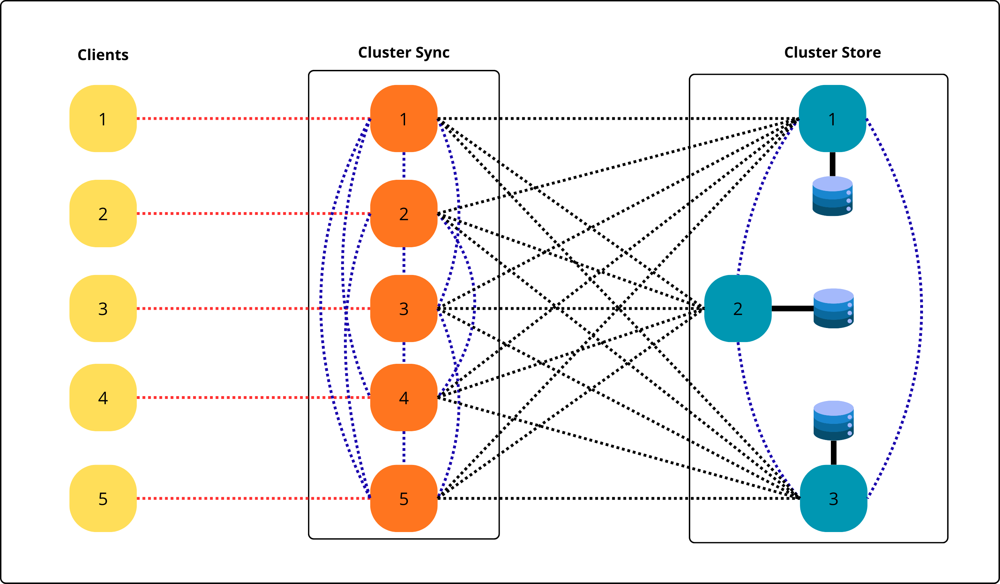

---

# Sincronização com Containers Docker

## Estrutura do Projeto

O presente projeto tem como objetivo o estudo e implementação de mecanismos de sincronização em sistemas distribuídos utilizando containers Docker. A proposta foi concebida de modo a simular o funcionamento de um **cluster tolerante a falhas**, onde múltiplas instâncias cooperam para garantir consistência na escrita de dados em arquivos compartilhados.

A arquitetura implementada é composta por três serviços principais:

1. **Cluster Sync**: Conjunto de containers responsáveis pela coordenação do cluster. Cada instância participa de um processo de comunicação distribuída para definir, através de um algoritmo de votação, qual container será eleito o líder. Este líder é o responsável por coordenar a escrita no arquivo compartilhado, assegurando que não ocorram inconsistências decorrentes de acessos concorrentes.

2. **Cluster Store**: Containers encarregados de realizar a escrita em arquivos locais. Embora cada instância mantenha seu próprio arquivo de backup, o processo de escrita segue uma ordem definida e controlada. Em caso de falha do líder atual, um novo container é eleito de forma automática, garantindo continuidade e disponibilidade do serviço.

3. **Client**: Módulo de clientes que enviam mensagens ao cluster. Cada cliente estabelece comunicação com os containers do Cluster Sync, os quais, após o processo de votação e coordenação, encaminham as mensagens para o Cluster Store, que realiza a escrita definitiva nos arquivos.

Cada container é identificado por um **ID único**, possuindo uma porta destinada à comunicação com os clientes e outra para comunicação interna com os demais containers do cluster. Esse modelo reflete, em escala reduzida, os desafios de sincronização em sistemas distribuídos reais.

## Tecnologias Utilizadas

O projeto foi desenvolvido utilizando **Python** e **Docker**, linguagens e ferramentas amplamente adotadas em cenários reais de computação distribuída.

<p align="center">  
    
    
</p>  

A utilização conjunta dessas tecnologias permitiu abstrair detalhes de infraestrutura, simplificar a criação dos containers e viabilizar a implementação de algoritmos de coordenação e sincronização de maneira eficiente e escalável.

## Arquitetura do Sistema

A seguir, a figura apresenta a visão geral da arquitetura desenvolvida:



A ilustração demonstra a interação entre os módulos **Client**, **Cluster Sync** e **Cluster Store**, evidenciando o fluxo de mensagens, o processo de votação para eleição de líderes e a gravação nos arquivos de saída.

## Arquivo Docker Compose

A configuração do ambiente é realizada por meio do arquivo `docker-compose.yml`, que define a inicialização e os parâmetros de cada serviço.

### Serviços principais:

* **Cluster Sync**: (`cluster_sync_1`, `cluster_sync_2`, ..., `cluster_sync_5`). Cada container possui um identificador único e escuta em portas específicas, desempenhando o papel de coordenador no processo de sincronização.
* **Cluster Store**: (`cluster_store_1`, `cluster_store_2`, `cluster_store_3`). Estes containers realizam a escrita nos arquivos de backup, garantindo consistência e tolerância a falhas por meio da eleição de líderes.
* **Clients**: (`client_1`, `client_2`, ..., `client_5`). Responsáveis por enviar mensagens ao cluster, as quais são processadas e registradas após a coordenação entre os containers.

O sistema de sincronização direciona as mensagens recebidas para o Cluster Store, que, por sua vez, grava os dados nos arquivos `shared_data/backup_0.txt`, `shared_data/backup_1.txt` e `shared_data/backup_2.txt`, de acordo com o identificador do container responsável.

## Execução

O projeto pode ser executado em qualquer ambiente com **Docker** e **Docker Compose** devidamente instalados. O fluxo básico de execução é:

1. Clonar o repositório:

   ```bash
   git clone https://github.com/Leonardo2716ba/cluster_store.git
   cd cluster_store
   ```

2. Construir e iniciar os containers:

   ```bash
   sudo docker-compose up --build
   ```

3. As mensagens enviadas pelos clientes são registradas no arquivo de saída compartilhado:

   ```bash
   cat shared_data/output.txt
   ```

4. Para encerrar a execução, basta remover os containers:

   ```bash
   sudo docker-compose down
   ```

## Arquivos Compartilhados

* **shared_data/output.txt**: Arquivo principal de saída, no qual são registradas todas as mensagens que passaram pelo processo de sincronização e votação entre os containers.
* **shared_data/backup_*.txt**: Arquivos auxiliares de backup, mantidos pelos containers do Cluster Store para redundância e tolerância a falhas.

## Detalhes Técnicos

* A comunicação entre os containers é realizada por **sockets TCP**, o que possibilita a simulação de um ambiente distribuído real.
* O sistema implementa um processo de **eleição de líderes**, garantindo que apenas um container tenha permissão de escrita em determinado instante, evitando condições de corrida.
* O cliente envia mensagens com **timestamps**, que são utilizados pelos containers durante o processo de coordenação, permitindo ordenação lógica dos eventos.
* O algoritmo de protocolo de **escrita remota** implementado é inspirado no modelo apresentado por **Tanenbaum e Van Steen** no livro *Distributed Systems: Principles and Paradigms* [^1].
* A arquitetura reflete conceitos clássicos de sistemas distribuídos, como **consistência de dados, coordenação de processos e tolerância a falhas**.

## Contribuições e Relevância

Este projeto representa uma aplicação prática de conceitos fundamentais de **Sistemas Distribuídos**, com ênfase na sincronização de processos, coordenação de acessos e gerenciamento de falhas.

---

## Referência Bibliográfica

[^1]: TANENBAUM, Andrew S.; VAN STEEN, Maarten. *Distributed Systems: Principles and Paradigms*. 2. ed. Upper Saddle River: Prentice Hall, 2007.

---
